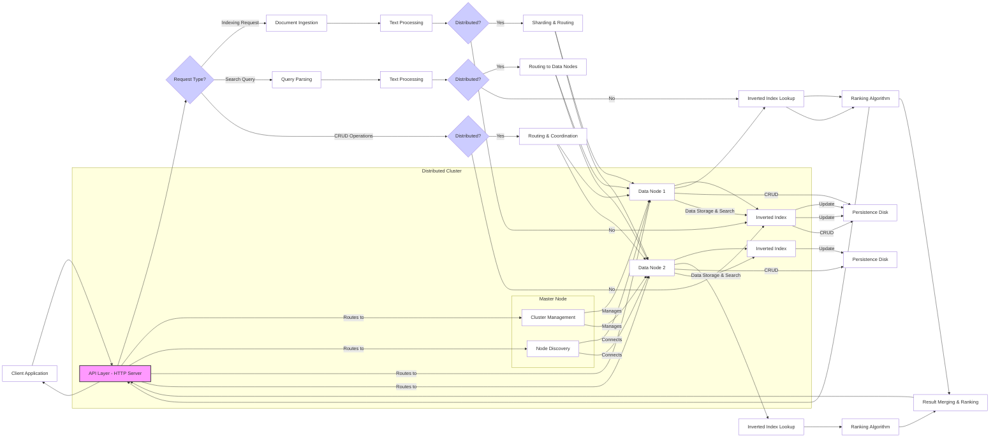

# gosearch

```mermaid
graph LR
    A[Client Application] --> B[API Layer - HTTP Server];
    B --> C{Request Type?};
    C -- Indexing Request --> D[Document Ingestion];
    D --> E[Text Processing];
    E --> F{Distributed?};
    F -- Yes --> G[Sharding & Routing];
    G --> H[Data Node 1];
    G --> I[Data Node 2];
    H --> J[Inverted Index];
    I --> K[Inverted Index];
    J -- Update --> L[Persistence Disk];
    K -- Update --> M[Persistence Disk];
    F -- No --> J;
    J -- Update --> L;
    C -- Search Query --> N[Query Parsing];
    N --> O[Text Processing];
    O --> P{Distributed?};
    P -- Yes --> Q[Routing to Data Nodes];
    Q --> H;
    Q --> I;
    H --> R[Inverted Index Lookup];
    I --> S[Inverted Index Lookup];
    R --> T[Ranking Algorithm];
    S --> U[Ranking Algorithm];
    T --> V[Result Merging & Ranking];
    U --> V;
    V --> B;
    P -- No --> R;
    R --> T;
    T --> B;
    C -- CRUD Operations --> W{Distributed?};
    W -- Yes --> X[Routing & Coordination];
    X --> H;
    X --> I;
    H -- CRUD --> L;
    I -- CRUD --> M;
    W -- No --> J;
    J -- CRUD --> L;
    B --> A;
    subgraph Distributed Cluster
        direction LR
        H -- Data Storage & Search --> J
        I -- Data Storage & Search --> K
        subgraph Master Node
            AA[Cluster Management]
            BB[Node Discovery]
        end
        AA -- Manages --> H
        AA -- Manages --> I
        BB -- Connects --> H
        BB -- Connects --> I
        B -- Routes to --> AA
        B -- Routes to --> BB
        B -- Routes to --> H
        B -- Routes to --> I
    end
    style A fill:#fff
    style B fill:#f9f,stroke:#333,stroke-width:2px
    style C fill:#ccf
    style D fill:#fff
    style E fill:#fff
    style F fill:#ccf
    style G fill:#fff
    style H fill:#fff
    style I fill:#fff
    style J fill:#fff
    style K fill:#fff
    style L fill:#fff
    style M fill:#fff
    style N fill:#fff
    style O fill:#fff
    style P fill:#ccf
    style Q fill:#fff
    style R fill:#fff
    style S fill:#fff
    style T fill:#fff
    style U fill:#fff
    style V fill:#fff
    style W fill:#ccf
    style X fill:#fff
    style AA fill:#fff
    style BB fill:#fff
```
