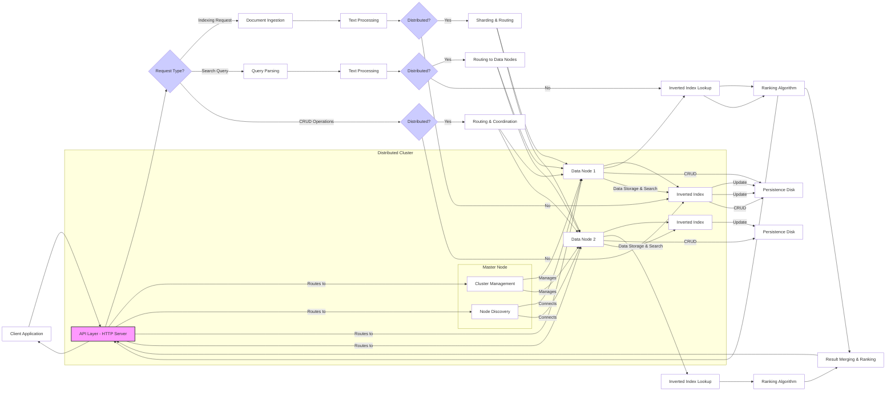

# gosearch

### Diagram of the Architecture

#### Erläuterung des Diagramms:

1. Client Application: Dies ist die Anwendung oder der Benutzer, der mit der Suchmaschine interagiert.
2. API Layer - Go HTTP Server: Dies ist die Schnittstelle der Suchmaschine, implementiert als HTTP-Server in Go (z.B. mit actix-web, warp oder hyper). Er empfängt Anfragen zum Indizieren, Suchen und für CRUD-Operationen.
3. Request Type?: Eine Entscheidungsstelle, die die Art der eingehenden Anfrage (Indizierung, Suche oder CRUD) unterscheidet.
4. Indexing Request:
    - Document Ingestion: Hier werden die zu indexierenden Dokumente entgegengenommen.
    - Text Processing - Go: Die Dokumente werden in Go verarbeitet (Tokenisierung, Stoppwortentfernung, Stemming/Lemmatisierung).
    - Distributed?: Eine Entscheidung, ob die Architektur verteilt ist.
    - Sharding & Routing: Wenn verteilt, werden die Dokumente auf verschiedene Datenknoten verteilt (Sharding).
    - Data Node 1/2: Repräsentieren einzelne Knoten im verteilten System.
    - Inverted Index - Go: Der Invertierte Index wird in Go auf den jeweiligen Datenknoten erstellt oder aktualisiert.
    - Persistence (Disk): Der Invertierte Index wird auf Festplatte gespeichert.
5. Search Query:
    - Query Parsing: Die Suchanfrage wird analysiert.
    - Text Processing - Go: Die Suchbegriffe werden analog zu den Dokumenten verarbeitet.
    - Distributed?: Entscheidung, ob die Suche über mehrere Knoten verteilt werden muss.
    - Routing to Data Nodes: Die Anfrage wird an die relevanten Datenknoten weitergeleitet.
    - Inverted Index Lookup: Die Datenknoten suchen im lokalen Invertierten Index nach passenden Dokumenten.
    - Ranking Algorithm - Go: Die Relevanz der gefundenen Dokumente wird mit einem Ranking-Algorithmus (z.B. TF-IDF oder BM25) in Go berechnet.
    - Result Merging & Ranking: Die Ergebnisse von verschiedenen Datenknoten werden zusammengeführt und erneut nach Relevanz sortiert.
6. CRUD Operations:
    - Distributed?: Entscheidung, ob die Operation im verteilten System durchgeführt werden muss.
    - Routing & Coordination: Die Operation wird an die entsprechenden Datenknoten geleitet und koordiniert.
    - CRUD: Die eigentlichen Erstell-, Lese-, Aktualisierungs- oder Löschoperationen auf dem Invertierten Index und der Persistenzebene.
7. Distributed Cluster:
    - Master Node: Verantwortlich für die Verwaltung des Clusters (Hinzufügen/Entfernen von Knoten, Überwachung des Zustands).
    - Node Discovery: Mechanismus, mit dem sich die Knoten im Cluster finden und miteinander kommunizieren können.
    - Data Node 1/2: Speichern die Daten und führen Suchoperationen aus.
8. Persistence (Disk): Speichert den Invertierten Index dauerhaft.

Dieses Diagramm bietet eine High-Level-Übersicht über die Architektur einer Elasticsearch-ähnlichen Suchmaschine, die in Go entwickelt werden könnte. Die Details der einzelnen Komponenten und deren Implementierung können je nach spezifischen Anforderungen variieren.
